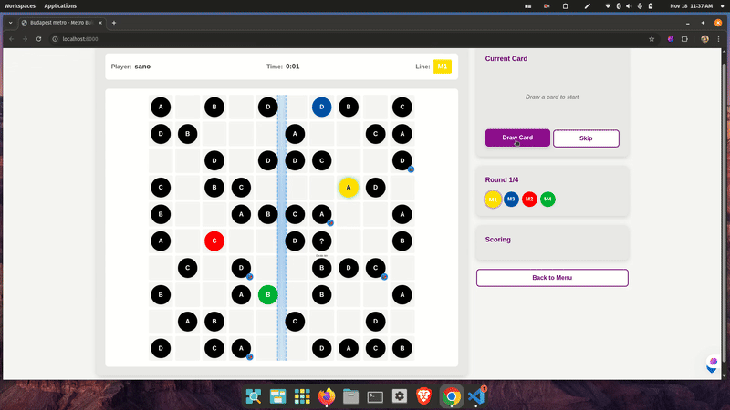
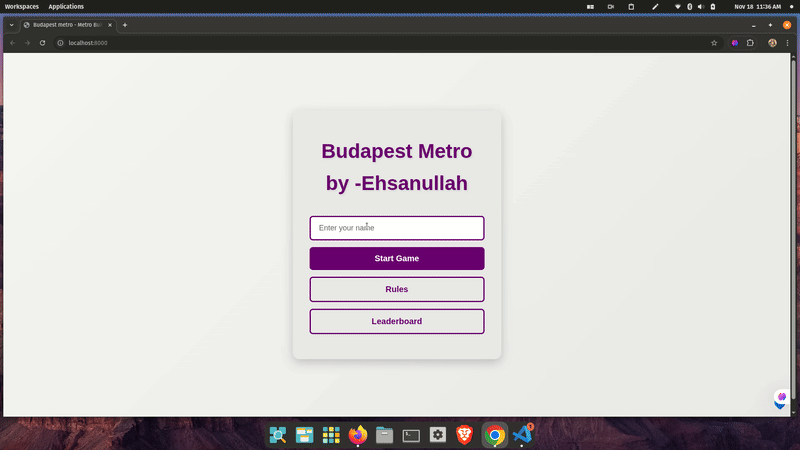

# 🚇 Budapest Metro Game

> **A single-player strategy game built with vanilla JavaScript - no frameworks or build tools required.**
> 
> *📚 3rd Semester Web Programming Assignment*

[](https://developer.mozilla.org/en-US/docs/Web/JavaScript)
[](https://developer.mozilla.org/en-US/docs/Web/HTML)
[](https://developer.mozilla.org/en-US/docs/Web/CSS)
[](https://github.com/SanoKhan22/BudapestMetro)

## 🎯 **About This Project**

A metro line building game where players connect stations according to specific rules. Built using vanilla JavaScript with MVC architecture and modern ES6+ features.

## 📸 **Live Demo**

### Game Start Screen


### Main Menu Interface  


**🚀 [Play Live Demo](https://sanokhan22.github.io/BudapestMetro/)**

## ⚡ **Technical Implementation**

### **JavaScript Features Used**
- **MVC Architecture**: Organized code structure with Controllers, Models, Views, and Utilities
- **ES6+ Features**: Classes, modules, async/await, destructuring
- **DOM Manipulation**: Event handling and dynamic content updates
- **Local Storage**: Persistent leaderboards and game state

### **Game Mechanics**
- **Angle Validation**: 45°/90° line segment restrictions
- **Intersection Detection**: Prevents overlapping metro lines
- **Scoring System**: Points based on districts covered and connections
- **Real-time Updates**: Timer and score tracking during gameplay

### **Code Structure**
```javascript
// Example: Clean, functional approach to validation
const ValidationEngine = {
  validateSegment: (from, to, existingSegments) => {
    return [
      GeometryUtil.isValidAngle(from, to),
      !IntersectionUtil.hasCollision(from, to, existingSegments),
      !LoopDetector.createsLoop(from, to, currentLine)
    ].every(Boolean);
  }
};
```

## 🎮 **Game Features**

| Feature | Implementation |
|---------|----------------|
| **Dynamic Grid System** | SVG-based rendering with responsive scaling |
| **Smart Card Engine** | Weighted random distribution with deck management |
| **Advanced Scoring** | District coverage, junction bonuses, railway multipliers |
| **Timer System** | Real-time updates with pause/resume functionality |
| **Leaderboard** | Persistent storage with sorting algorithms |

## 🏗️ **Architecture Overview**

```
src/
├── controllers/     # Game logic orchestration
├── models/         # Data structures & business logic  
├── views/          # UI rendering & DOM management
├── utils/          # Algorithms & helper functions
└── constants.js    # Configuration & game rules
```

**Design Patterns:**
- MVC Architecture for code organization
- Event-driven programming for user interactions
- Modular structure for maintainability

## 🔧 **Technical Features**

✅ **No Dependencies** - Pure JavaScript, HTML, and CSS  
✅ **Modern JavaScript** - ES6+ syntax and features  
✅ **Responsive Design** - Works on desktop and mobile  
✅ **Local Storage** - Persistent leaderboards  
✅ **SVG Graphics** - Scalable game board rendering  

## 🚀 **Quick Start**

```bash
# Clone and run locally
git clone https://github.com/SanoKhan22/BudapestMetro.git
cd BudapestMetro
python -m http.server 8000
# Open http://localhost:8000
```

**No build process required** - runs directly in the browser!

## 💡 **Code Quality Standards**

This project follows **strict development practices**:

- ✅ **Modern JavaScript**: `const`/`let` only, arrow functions, template literals
- ✅ **Clean DOM API**: `querySelector`/`addEventListener` exclusively  
- ✅ **No Legacy Code**: Zero `var`, `getElementById`, or inline handlers
- ✅ **Functional Programming**: Immutable operations where possible
- ✅ **Error Handling**: Comprehensive validation and fallbacks

## 🎯 **What I Learned**

This project helped me practice:

- State management without external libraries
- Custom event handling and DOM manipulation
- Algorithm implementation for game logic
- Code organization with MVC pattern
- Browser APIs for data persistence

## 🔧 **Installation & Usage**

No build process required - just open `index.html` in a browser or run a local server.

---

**Built with ❤️ and vanilla JavaScript by [SanoKhan22](https://github.com/SanoKhan22)**

*Interested in my work? Let's connect on [LinkedIn](https://linkedin.com/in/ehsanullahsano) or check out my other projects.*